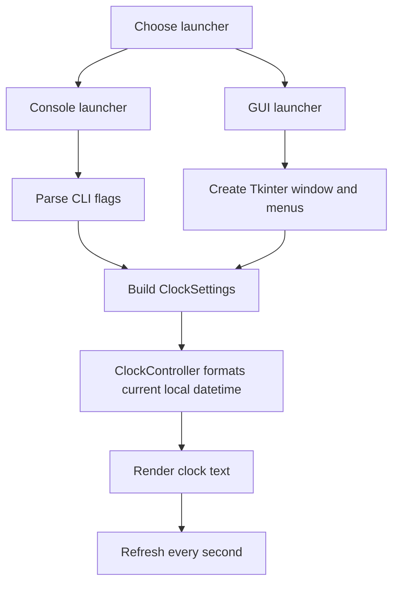

# Digital Clock System

Author: Omowu George Omajuwa  
Matric Number: 25/18097  
Department: Software Engineering  
Course: SEN 201

This project started as a simple 24-hour console clock for a Software Engineering assignment. It has now been refactored into a maintainable Python project with a shared clock core, a console launcher, and a Tkinter GUI launcher.

## Features

- Live local time updates every second
- 24-hour mode by default
- Optional 12-hour mode with AM/PM
- Optional date display
- Console and GUI front ends backed by the same logic
- Standard-library-only implementation

## Project Structure

- `24-Hour-Digital-Clock.py` - legacy console entrypoint kept for backward compatibility
- `clock_gui.py` - GUI entrypoint
- `clock_app/` - shared clock package
- `tests/` - unit tests for formatting, console parsing, and GUI state handling
- `24-Hour-Digital-Clock-Pseudocode.txt` - updated system pseudocode
- `24-Hour-Digital-Clock-Flowchart.jpg` - original coursework flowchart kept as a historical asset

## Editable Flow



The JPG flowchart remains in the repository for the original assignment record, but the Mermaid diagram above is now the maintained source of truth.

## How to Run

### Console

Run the original entry script:

```bash
python 24-Hour-Digital-Clock.py
```

Optional flags:

```bash
python 24-Hour-Digital-Clock.py --format 12
python 24-Hour-Digital-Clock.py --date
python 24-Hour-Digital-Clock.py --format 12 --date
```

### GUI

```bash
python clock_gui.py
```

Use the GUI menu bar to:

- Switch between 12-hour and 24-hour time
- Toggle date display
- Exit the application

## Testing

Run the unit tests with:

```bash
python -m unittest discover -s tests -v
```

## Maintenance Improvements

- Moved formatting and settings into a shared importable package
- Removed import-time execution from the legacy script
- Replaced full-screen console clearing with in-place clock updates
- Added GUI support without third-party dependencies
- Added automated tests for the main behaviors
- Fixed documentation commands and text encoding issues
